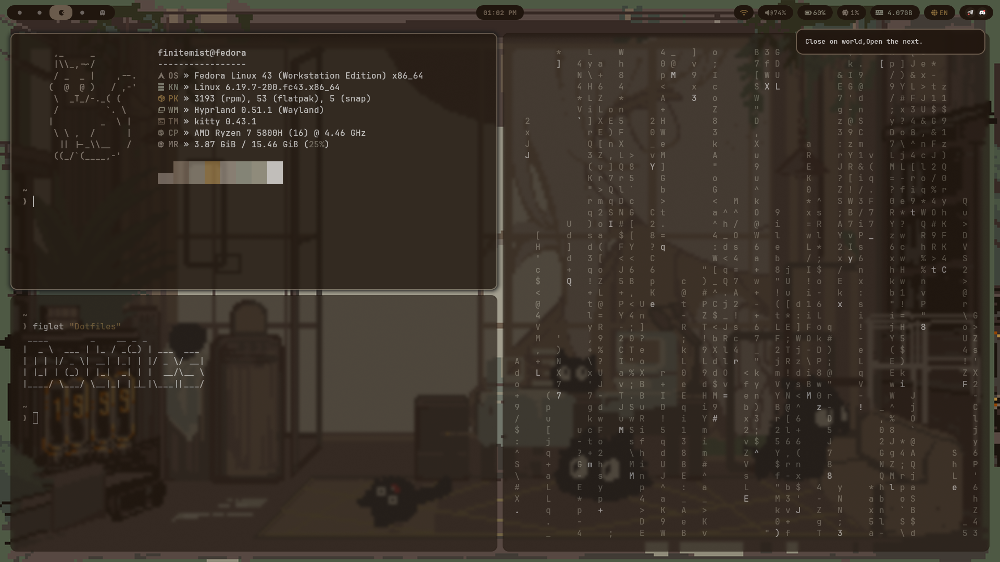
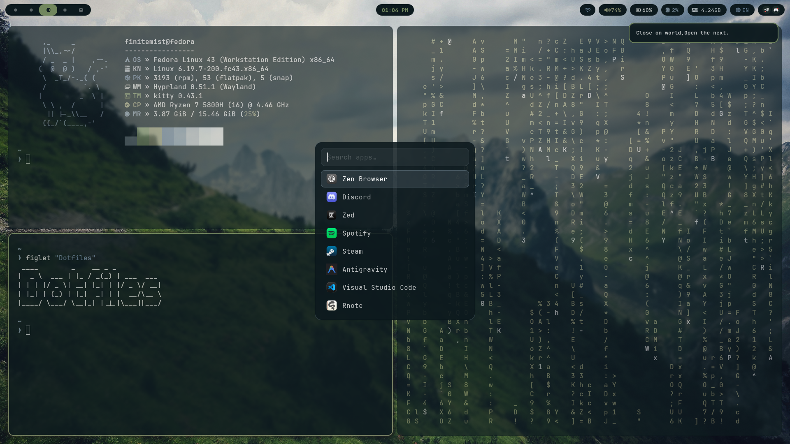

# dotfiles

My personal Hyprland dotfiles for Fedora Linux — themed dynamically with [pywal](https://github.com/dylanaraps/pywal).

## Screenshots

| Desktop + Fastfetch | Rofi Launcher |
|---|---|
|  |  |

## Stack

| Tool | Purpose |
|------|---------|
| [Hyprland](https://hyprland.org) | Wayland compositor |
| [Waybar](https://github.com/Alexays/Waybar) | Status bar |
| [Kitty](https://sw.kovidgoyal.net/kitty/) | Terminal emulator |
| [Fish](https://fishshell.com) | Shell |
| [Rofi](https://github.com/davatorium/rofi) | App launcher |
| [Mako](https://wayland.emersion.fr/mako/) | Notification daemon |
| [SwayNC](https://github.com/ErikReider/SwayNotificationCenter) | Notification center |
| [Pywal](https://github.com/dylanaraps/pywal) | Wallpaper-driven color scheme generator |
| [Starship](https://starship.rs) | Shell prompt |
| [Fastfetch](https://github.com/fastfetch-cli/fastfetch) | System info display |

## Features

- **Full pywal integration** — Hyprland borders, Waybar, Rofi, Mako, and SwayNC all theme from your wallpaper automatically
- **swww wallpaper** — smooth center-transition animations when changing wallpapers
- **Waybar** — workspace indicators, clock, network, audio, battery, CPU/RAM, keyboard language switcher
- **Rofi** — macOS-style app launcher with MacTahoe icon theme
- **Wallpaper Picker** — visual grid picker with thumbnails, random/next/prev cycling, and full pywal integration
- **Mako + SwayNC** — polished notifications with per-urgency styling, volume/brightness HUD, and per-app accent colors
- **Arabic/English** dual keyboard layout with `Alt+Shift` toggle and live indicator in Waybar
- **Dual-monitor** workspace layout (laptop `eDP-1` + external `HDMI-A-1`)
- **Screenshots** with `grim` + `slurp`, auto-saved to `~/Pictures/Screenshots/` and copied to clipboard
- **NVIDIA** environment variables pre-configured

## Structure

```
dotfiles/
├── fastfetch/               # System info config + ASCII logo
│   ├── config.jsonc
│   └── cat.txt
├── fish/                    # Fish shell
│   └── config.fish          # Main config (PATH, aliases, functions)
├── hypr/
│   └── hyprland.conf        # Compositor config (monitors, keybinds, rules, animations)
├── kitty/
│   └── kitty.conf           # Terminal config (font, opacity, pywal colors)
├── rofi/
│   ├── generate-rofi.sh     # Regenerates theme.rasi from pywal palette
│   ├── theme.rasi           # Active launcher theme (auto-generated)
│   ├── wallpaper-picker.sh  # Visual wallpaper picker with pywal integration
│   └── wallpaper-picker.rasi # Wallpaper picker rofi theme
├── swaync/
│   ├── config.json          # Notification center layout + behavior
│   └── style.css            # Notification styling (themed via pywal)
├── wal/
│   └── templates/           # Pywal templates — installed to ~/.config/wal/templates/
│       ├── colors-swaync.css
│       ├── mako
│       └── tray.css
├── waybar/
│   ├── config               # Module layout and options
│   ├── style.css            # Bar styling (themed via pywal)
│   └── get_language.sh      # Live keyboard layout indicator script
├── install.sh               # Symlink installer (safe to re-run)
└── README.md
```

## Installation

### Prerequisites

Install the following packages (Fedora example using DNF / Flatpak):

> **Note — COPR repositories**
> Some packages may not be in the official Fedora repos yet. Enable these
> COPRs first if a package is missing:
> ```bash
> # Hyprland (if not yet in Fedora 43+)
> sudo dnf copr enable solopasha/hyprland
>
> # SwayNotificationCenter
> sudo dnf copr enable erikreider/SwayNotificationCenter
> ```

```bash
# Core WM stack
sudo dnf install hyprland waybar kitty fish rofi mako

# Notification center
sudo dnf install SwayNotificationCenter

# Wallpaper & theming
pip install pywal          # or: sudo dnf install python3-pywal
sudo dnf install swww swaylock

# Waybar dependencies
sudo dnf install wireplumber pavucontrol NetworkManager-tui playerctl brightnessctl

# Screenshots
sudo dnf install grim slurp wl-clipboard

# Fonts (JetBrainsMono Nerd Font)
sudo dnf install jetbrains-mono-fonts
# Or install from: https://www.nerdfonts.com/font-downloads

# Optional but recommended
sudo dnf install fastfetch starship socat jq

# Rofi icon theme (MacTahoe)
# Download from: https://www.gnome-look.org/p/1405756
```

### Setup

```bash
# 1. Clone the repo
git clone https://github.com/finitemist/dotfiles.git ~/dotfiles
cd ~/dotfiles

# 2. Run the installer
chmod +x install.sh
./install.sh
```

The installer creates symlinks from `~/.config/*` to this repo and copies the
pywal templates to `~/.config/wal/templates/`. It is **idempotent** — safe to
re-run after pulling updates.

### Apply a Wallpaper & Theme

Use the `sw` function (defined in `fish/config.fish`) to set a wallpaper and
regenerate all color schemes in one command:

```fish
sw ~/Pictures/wallpapers/my-wallpaper.jpg
```

This will:
1. Start `swww-daemon` if not already running
2. Set the wallpaper with a smooth center transition
3. Run `pywal` to generate the color palette
4. Regenerate the Rofi theme (`rofi/generate-rofi.sh`)
5. Reload Waybar (`SIGUSR2`)
6. Reload SwayNC CSS (`swaync-client --reload-css`)

Pywal also automatically restores the last color scheme on every new shell
session (via `wal -R`).

### Wallpaper Picker (GUI)

Press `Super + W` to open a visual wallpaper picker with thumbnail previews:

| Keybind | Action |
|---------|--------|
| `Super + W` | Open wallpaper picker (grid view) |
| `Super + Shift + W` | Apply random wallpaper |
| `Super + Alt + ]` | Next wallpaper |
| `Super + Alt + [` | Previous wallpaper |

The picker scans `~/Pictures` for images (excluding `Screenshots/` and `Camera/`), displays them in a rofi grid, and applies the selected wallpaper with full pywal theming.

## Keybindings

| Keybind | Action |
|---------|--------|
| `Super + Q` | Open terminal (Kitty) |
| `Super + E` | Open file manager (Ranger in Kitty) |
| `Super + R` | Open app launcher (Rofi) |
| `Super + W` | Open wallpaper picker |
| `Super + Shift + W` | Random wallpaper |
| `Super + C` | Close active window |
| `Super + F` | Toggle fullscreen |
| `Super + V` | Toggle floating |
| `Super + P` | Pseudotile (dwindle) |
| `Super + J` | Toggle split direction (dwindle) |
| `Super + S` | Toggle scratchpad |
| `Super + Shift + S` | Move window to scratchpad |
| `Super + 1–0` | Switch to workspace 1–10 |
| `Super + Shift + 1–0` | Move window to workspace 1–10 |
| `Super + Arrow keys` | Move focus |
| `Super + Shift + Arrow keys` | Move window |
| `Super + Ctrl + Arrow keys` | Resize window |
| `Super + Ctrl + Shift + ↑/↓` | Move workspace to monitor |
| `Alt + Tab` | Cycle through windows |
| `Super + mouse drag` | Move floating window |
| `Super + right-click drag` | Resize floating window |
| `Super + scroll` | Scroll through workspaces |
| **Power** | |
| `Super + Alt + L` | Lock screen (swaylock) |
| `Super + Alt + S` | Suspend |
| `Super + Alt + R` | Reboot |
| `Super + Alt + P` | Power off |
| `Super + Alt + M` | Exit Hyprland |
| **Media** | |
| `XF86AudioRaiseVolume` | Volume +5% |
| `XF86AudioLowerVolume` | Volume −5% |
| `XF86AudioMute` | Toggle mute |
| `XF86AudioMicMute` | Toggle mic mute |
| `XF86MonBrightnessUp/Down` | Screen brightness |
| `XF86AudioPlay/Pause/Next/Prev` | Media controls (playerctl) |
| **Screenshots** | |
| `Print` | Select area → save + copy to clipboard |
| `Shift + Print` | Active monitor → save + copy to clipboard |

## Customization Notes

### Monitors
Edit the `monitor=` lines in `hypr/hyprland.conf` to match your display setup:

```ini
monitor = eDP-1,1920x1080@144,0x0,1.0       # laptop (main)
monitor = HDMI-A-1,1360x768@60,0x-768,1.0   # external above laptop
```

See the [Hyprland monitor wiki](https://wiki.hypr.land/Configuring/Monitors/) for the full syntax.

### NVIDIA
The NVIDIA environment variables at the top of `hypr/hyprland.conf` can be
removed if you are on an AMD or Intel GPU:

```ini
env = LIBVA_DRIVER_NAME,nvidia
env = GBM_BACKEND,nvidia-drm
env = __GLX_VENDOR_LIBRARY_NAME,nvidia
```

### Pywal Templates
The files in `wal/templates/` are copied (not symlinked) to
`~/.config/wal/templates/` by `install.sh`. Pywal reads them when generating
color schemes. Edit them there to tweak how each app is themed.

## Dependencies Summary

| Package | Required for |
|---------|-------------|
| `hyprland` | Window manager |
| `waybar` | Status bar |
| `kitty` | Terminal |
| `fish` | Shell |
| `rofi` | App launcher |
| `mako` | Notifications |
| `swaync` | Notification center |
| `pywal` | Color theming |
| `swww` | Wallpaper daemon |
| `swaylock` | Screen lock |
| `grim` + `slurp` | Screenshots |
| `wl-clipboard` | Clipboard (`wl-copy`) |
| `wireplumber` / `wpctl` | Volume control |
| `brightnessctl` | Brightness control |
| `playerctl` | Media key control |
| `socat` + `jq` | Language indicator script |
| `starship` | Shell prompt |
| `fastfetch` | System info on shell start |
| `JetBrainsMono Nerd Font` | Font for all apps |